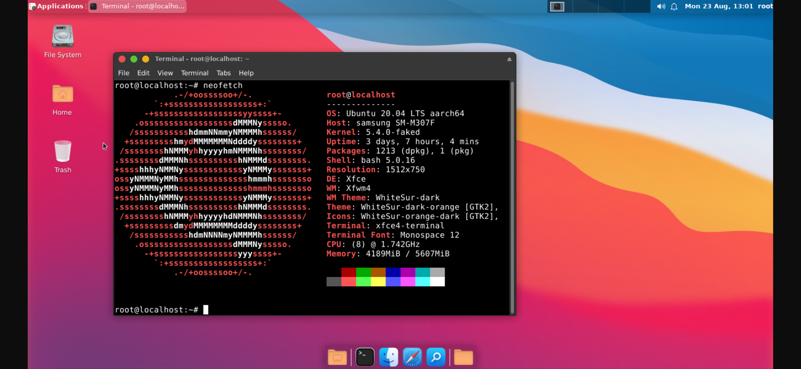
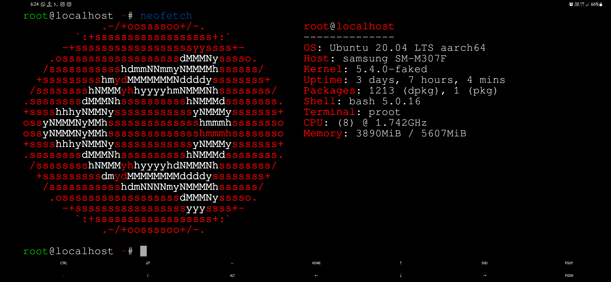

<p align="center"><b>Run Ubuntu GUI on your termux with much features.</b></p>

### Features

- Fixed Audio Output
- Lightweight { Requires at least 4GB Storage }
- WhiteSur macOS theme ( GTK + ICON + CURSORS )
- 2 Browsers ( Chromium & Firefox )
- Supports Indian Fonts & Emoji Support
- Java installed ( open JDK 8 ) [ [installation](https://github.com/ShivaShirsath/Install-JDK-in-Ubuntu) ]
- Visual Studio Code 
- Easy for Beginners

### Installation

- First Clone the Repository & Run the setup File

  ```bash
  pkg update -y && pkg upgrade -y
  pkg install git wget -y
  cd ~
  git clone git://github.com/ShivaShirsath/termux-ubuntu.git
  cd termux-ubuntu
  bash setup.sh
  ```

- Then Restart your Termux & Type the following commands

  ```bash
  ubuntu
  bash user.sh
  ```

- Type your ubuntu root username. Must be lowercase & no space included.

- Then Again Restart your Termux & Type the following commands

  ```bash
  ubuntu
  bash gui.sh
  ```

- [ Install VNC VIEWER Apk on your Device. ](https://play.google.com/store/apps/details?id=com.realvnc.viewer.android&hl=en)

- **You have to note your VNC password !!**

- Ubuntu image is now successfully installed .

  - Type `vncstart` to run Vncserver
    ```bash
    vncstart
    ```
  - Type `vncstop` to stop Vncserver
    ```bash
    vncstop
    ```

- Open VNC VIEWER & Click on ╋ Button & Enter the Address `localhost:5901` & Name anything you like
  
  **OR**
  ```bash
  termux-open vnc://localhost:5901
  ```
- Set the Picture Quality to High for better Quality
- Click on Connect & Input the Password 
- Enjoy :D

### NOTE :

- **Type `ubuntu` to run Ubuntu CLI.**
- **Type `vncstart` to run Vncserver**
- **Type `vncstop` to stop Vncserver**

- **Type `bash remove.sh` to remove Ubuntu Modded Os**

### Install neofetch `sudo apt install neofetch` for Checking Version : 



### Credits 

   
   > This Tool Uses the ubuntu image provided by the termux package `proot-distro`    
   > Full Credit of the Ubuntu image goes to them    
   > Termux Proot Distro - https://github.com/termux/proot-distro   
   

### If you like our work then dont forget to give a Star :)

